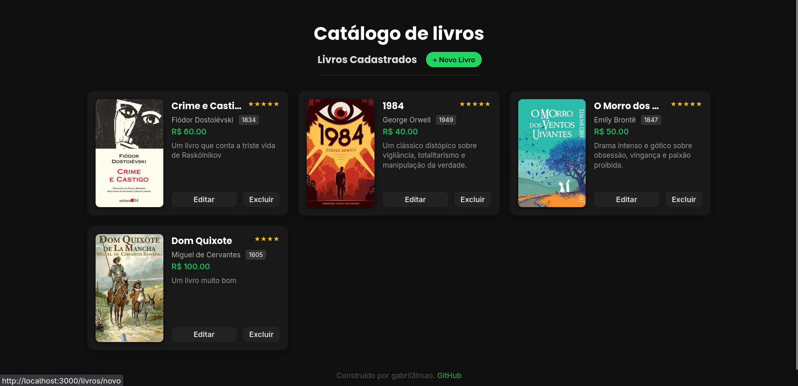
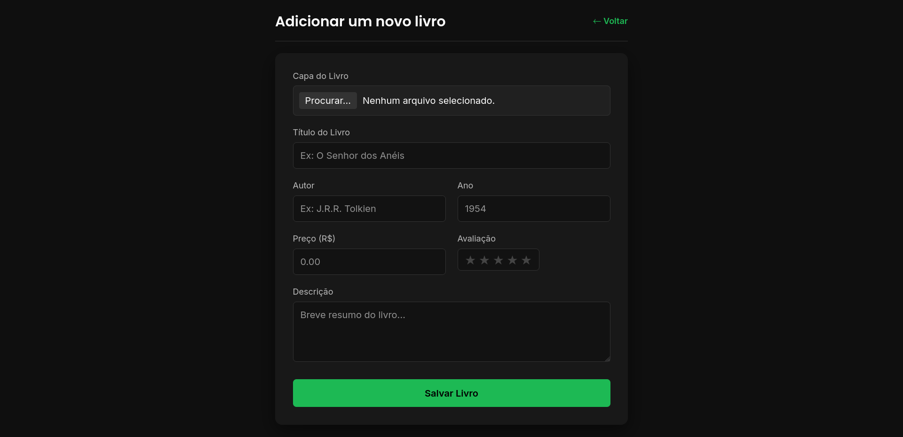
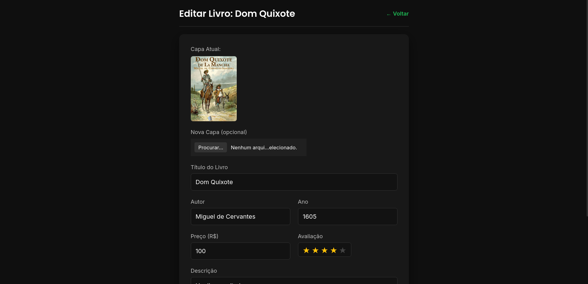

📚 BIBLIOTECA-LIVROS API

API RESTful desenvolvida em Node.js para gerenciamento de um catálogo de livros (CRUD) utilizando Express, Sequelize e SQLite3.
💻 Tecnologias Utilizadas
- Linguagem: JavaScript (Node.js)
- Framework: Express
- ORM: Sequelize
- Banco de Dados: SQLite3
- Estrutura: MVC (Model-View-Controller)

## 🖼️ Prévia do Projeto





⬇️ Como Baixar e Instalar

Para rodar este projeto localmente, siga os passos abaixo:
1. Requisitos

Certifique-se de ter o Node.js e o npm (ou Yarn) instalados na sua máquina.

2. Clonar o Repositório

``` 
git clone https://github.com/gabrii3lmao/biblioteca.git
cd BIBLIOTECA-LIVROS
```
3. Instalar Dependências

Instale todas as bibliotecas necessárias definidas no package.json:

```
npm install 
# ou
yarn install
```
4. Inicializar o Servidor

Inicie o servidor Express. O Sequelize irá criar automaticamente o arquivo biblioteca.db e a tabela livros se eles não existirem.

```
node server.js
# ou, se estiver usando um pacote como nodemon:
npm start 
```
O servidor estará rodando em http://localhost:3000.

⚙️ Rotas da API (Endpoints)

Todas as rotas devem ser acessadas na URL base: http://localhost:3000.

Para interagir com a API, você pode usar ferramentas como Insomnia ou Postman, que permitem enviar requisições HTTP de forma prática.

Exemplo 1: Cadastrar um Livro (POST)

- Crie uma nova requisição.
- Método: POST
- URL: http://localhost:3000/livros
- Body (Corpo): Escolha o formato JSON e insira os dados do livro:
```
{
    "nome": "O Guia do Mochileiro das Galáxias",
    "autor": "Douglas Adams",
    "anoLancamento": 1979,
    "preco": 45.90,
    "descricao": "Uma trilogia de cinco livros."
}
```
- Clique em Enviar (Send). A API deve retornar o objeto do livro criado com o status 201 Created.

Exemplo 2: Listar Todos os Livros (GET)

- Crie uma nova requisição.
- Método: GET
- URL: http://localhost:3000/livros
- Body (Corpo): Deixe vazio (No Body).

Clique em Enviar (Send). A API deve retornar um array [] com todos os livros cadastrados (status 200 OK).
